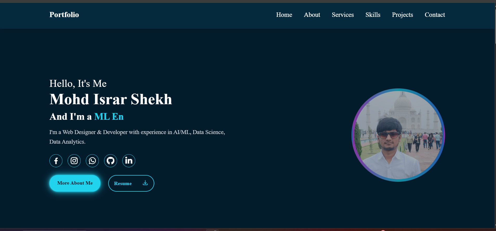

# 🚀 Israr Portfolio Website

A modern, responsive personal portfolio website showcasing my skills, projects, and experience in **Web Development, Data Science, and AI/ML**.  
Built using **HTML, Tailwind CSS, and JavaScript** with smooth animations and a clean UI.

---

## 👤 About Me

Hi 👋, I’m **Mohd Israr Shekh**  
A passionate **Web Developer, Data Scientist & AI/ML Engineer** who loves building clean user interfaces and intelligent, data-driven solutions.

---

## 🌐 Live Demo

🔗 **Portfolio Live:**  
visite : https://israr-ai.netlify.app/

vercel :https://israr-portfolio-sepia.vercel.app/

---

## 📂 GitHub Repository

🔗 **Source Code:**  
https://github.com/israr-ai/israr-portfolio

---

## 🛠️ Tech Stack

- **Frontend:**  
  - HTML5  
  - CSS3  
  - Tailwind CSS  
  - JavaScript  

- **UI & Icons:**  
  - Font Awesome  
  - Custom animations  

- **Tools & Platforms:**  
  - Git & GitHub  
  - Vercel (Deployment)

---

## ✨ Features

- Responsive design (Mobile, Tablet & Desktop)
- Animated navbar and smooth scrolling
- Typing text animation in hero section
- Services section (Data Science, AI/ML, Data Analysis)
- Skills section (Technical & Professional)
- Project slider with GitHub & Live Demo links
- Contact form with **Web3Forms API**
- Social media integration (GitHub, LinkedIn, WhatsApp, Instagram)

---

## Sections Included

- Home
- About Me
- Services
- Skills
- Projects
- Contact

---

## Project Structure
```
israr-portfolio/
│── asset/
│ ├── images & icons
│── tailcss.css
│── main.js
│── index.html
│── resume.html
│── README.md
```


---

## 📬 Contact Me

- 📧 Email: **israrshekh.code22@gmail.com**
- 📞 Phone: **+91 9044508134**
- 💼 LinkedIn: https://www.linkedin.com/in/israrshekh-dev/
- 🐙 GitHub: https://github.com/israr-ai

---

## 🚀 Future Improvements

- Add backend (Node / Laravel)
- Dark–Light theme toggle
- Blog section
- AI/ML project demos

---

## ❤️ Acknowledgements

Designed & Developed with ❤️ by **Mohd Israr Shekh**

© 2025 All Rights Reserved
